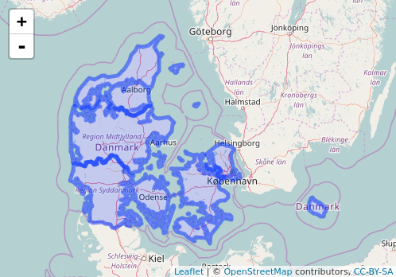

<!-- README.md is generated from README.Rmd. Please edit that file -->

```{r, echo = FALSE}
knitr::opts_chunk$set(
  collapse = TRUE,
  comment = "#>",
  fig.path = "README-"
)
```

# geoDK

The goal of geoDK is to make it easy to use danish GIS data in R.

## Installation

You can install geoDK from github with:

```{r gh-installation, eval = FALSE}
# install.packages("devtools")
devtools::install_github("mikkelkrogsholm/geoDK")
```

## Polygons

geoDK contains polygon data for a range of danish administrative areas. It has data for: 

* parishes
* zip codes
* municipalities
* rural areas
* regions

Let me show you a few examples. 


#### First load packages and necessary data
```{r example1_load}
library(geoDK)

data("region.polygon")

```

#### Plot it using `ggplot()`
We can also plot the data using ggplot2. We just need to do a little data wrangling to make the data plotable through ggplot2.

```{r}
# Load ggplot2
library(ggplot2)

# Load ggthemes to get the theme_map() function
library(ggthemes)

# We need to fortify the polygon. It basically takes the polygon and turns it into a 
# data frame that ggplot2 can use for plotting.
region.df = fortify(region.polygon)

# Lets have a look at it
head(region.df, 10)
```

What a nice tidy data frame. Now lets plot it.

```{r}
# First we give ggplot() the data frame, then we specify long and lat on the axis
# and we tell it to group by group and give fill-color by id.
ggplot(region.df, aes(long, lat, group = group, fill = id)) + 
  # Then we plot the polygons
  geom_polygon(show.legend = F) +
  # Then we draw white lines to separate the regions
  geom_path(color="white") + 
  # Finally we apply the map theme
  theme_map()
```

Since this is a ggplot object it also means that you can you all sorts of things to it. Like put an underlying map under it.

#### Plot it with `ggmap()` and `ggplot()`

```{r}
library(ggmap)

# First we get map data for our underlying map. 
mymap <- get_map(location = c(min(region.df$long), min(region.df$lat),
                              max(region.df$long), max(region.df$lat)),
                source = "osm")
```

With our new map we can easily overlay the ggplot2 elements from above. Lets draw red regional boundaries on the map.

```{r}
ggmap(mymap) +
  geom_path(data = region.df, aes(long, lat, group = group), color = "red")
```

Or lets fill the map with our regions

```{r}
ggmap(mymap) +
  geom_polygon(data = region.df, aes(long, lat, group = group, fill = id), show.legend = F) +
  geom_path(data = region.df, aes(long, lat, group = group), color = "red")
```

#### Plot it with `leaflet()`

It is also really easy to plot it interactively with the leaflet package.

```{r, eval=FALSE}
library(leaflet)

leaflet(region.polygon) %>%
  addTiles() %>%
  addPolygons()

```



Voila! Interactive map.
