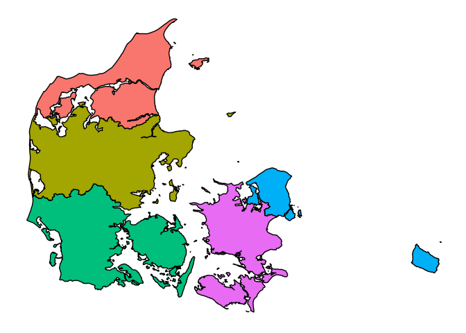
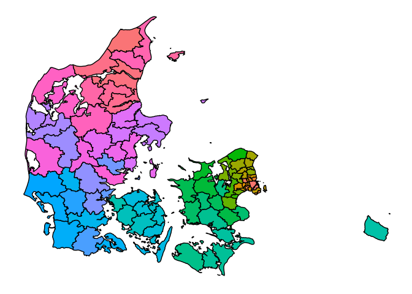
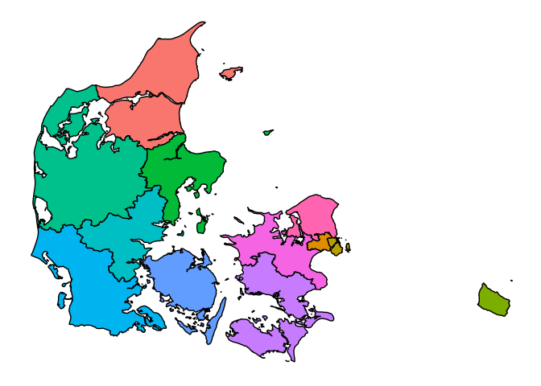

<!-- README.md is generated from README.Rmd. Please edit that file -->
geoDK
=====

The goal of geoDK is to make it easy to use danish GIS data in R.

Installation
------------

You can install geoDK from github with:

``` r
# install.packages("devtools")
devtools::install_github("mikkelkrogsholm/geoDK")
```

Polygons
--------

geoDK contains polygon data for a range of danish administrative areas. It has data for:

-   parishes
-   zip codes
-   municipalities
-   regions
-   police districts
-   jurisdictions
-   constituencies

Let me show you a few examples.

#### First load packages

``` r
library(geoDK)
#> ## geoDK uses data from the Danish Geodata Agency
#> ## Terms and conditions apply.
#> ## Read more at: https://kortforsyningen.dk/indhold/vilkaar-og-betingelser
library(ggplot2)
library(ggthemes)
```

#### Plot regions

``` r
dk_regions <- geo_get_spatial("Danish regions")

df_regions <- make_tidy_poly(dk_regions)

ggplot(df_regions) +
  geom_polygon(aes(x = lng, y = lat, group = area, fill = regionkode),
               color = "black", show.legend = FALSE) +
  coord_cartesian() +
  theme_map()
```



#### Plot municipalities

``` r
dk_municipalities <- geo_get_spatial("Danish municipalities")

df_municipalities <- make_tidy_poly(dk_municipalities)

ggplot(df_municipalities) +
  geom_polygon(aes(x = lng, y = lat, group = area, fill = komkode),
               color = "black", show.legend = FALSE) +
  coord_cartesian() +
  theme_map()
```



#### Plot police districts

``` r
dk_police_districts <- geo_get_spatial("Danish police districts")

df_police_districts <- make_tidy_poly(dk_police_districts)

ggplot(df_police_districts) +
  geom_polygon(aes(x = lng, y = lat, group = area, fill = polkr_nr),
               color = "black", show.legend = FALSE) +
  coord_cartesian() +
  theme_map()
```



#### Plot zip codes

``` r
dk_zip_codes <- geo_get_spatial("Danish zip codes")

df_zip_codes <- make_tidy_poly(dk_zip_codes)

ggplot(df_zip_codes) +
  geom_polygon(aes(x = lng, y = lat, group = area, fill = postnr_txt),
               color = "black", show.legend = FALSE) +
  coord_cartesian() +
  theme_map()
```


